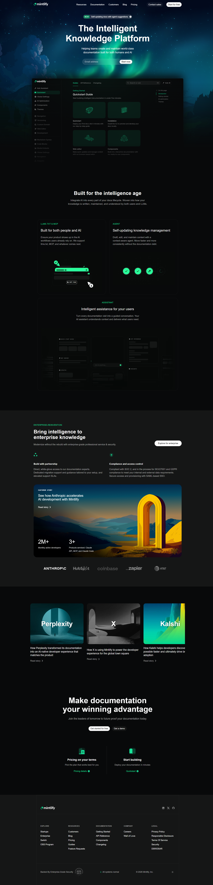

# Mintlify UI Clone

Clone of the Mintlify landing page built with HTML, CSS, and Vite.



## 📋 Recreated Sections

- **Header** - Navigation with logo and CTA buttons
- **Hero** - Main title, description, and email signup form
- **Built for Intelligence Age** - Feature cards (LLMS.TXT, Agent, Assistant)
- **Enterprise** - Enterprise features and Anthropic customer story
- **Customer Stories** - Carousel with Perplexity, X, and Kalshi stories
- **CTA Section** - Final call-to-action with feature cards
- **Footer** - Navigation links, social icons, and SOC 2 badge

## 🎨 Design System

### Fonts
- **Primary**: Inter 

### Colors
- **Brand Green**: `lab(79.9844% -59.6292 22.5096)` (#18E299)
- **Brand Dark**: `lab(51.3415% -41.5657 15.3527)` (#0C8C5E)
- **Background**: `lab(2.42579% -.165291 -.470081)` (Dark)

## 🚀 Quick Start

There are multiple ways to run this project locally:

### Option 1: Using Bun (Recommended)

[Bun](https://bun.sh) is a fast JavaScript runtime that can run this project efficiently.

```bash
# Install dependencies
bun install

# Start development server
bun run dev
```

The site will be available at `http://localhost:5173`

### Option 2: Using npm/pnpm/yarn

If you don't have Bun installed, you can use any Node.js package manager:

```bash
# Using npm
npm install
npm run dev

# Using pnpm
pnpm install
pnpm dev

# Using yarn
yarn install
yarn dev
```

The site will be available at `http://localhost:5173`

## 📄 License

This is a clone project for educational purposes.
